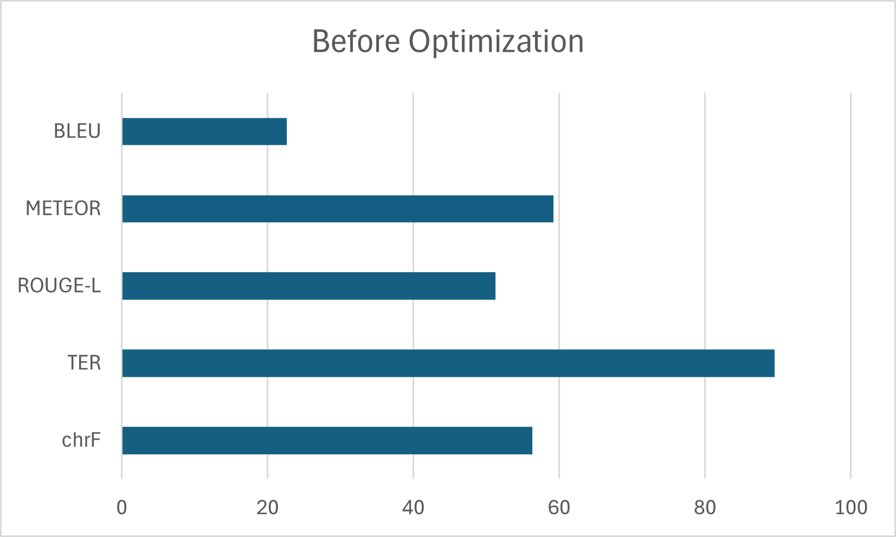
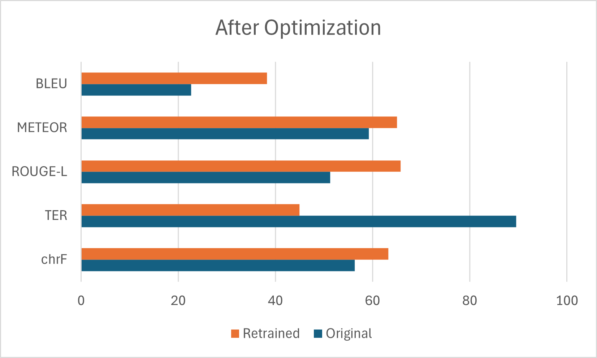

# AI Machine Translation

This is a simple retraining for an existing EN-ID translation model, Helsinki-NLP/opus-mt-en-id. It was retrained using the Helsinki-NLP/opus-100 en-id dataset. This was developed alongside my teammates as a final project for the Artificial Intelligence (AI) course at my university.

## Results

Here are the result for this project. We compared 5 different metrics.

| Before Training | After Training |
| :-------------: | :------------: |
|  |  |

## The Final Re-trained Model

Since it is too large to be included in this Git repository, you can access our final model from the following link:
[Download the model from HuggingFace](https://huggingface.co/Mechabruh/retrained_model_2nd_iter)

Once downloaded, place it in the '/models' directory if you want to use our model locally.

## Setup & Installation

To set up this project on your own device, follow these steps:

1. Clone the repository 'git clone https://github.com/MechaOrange1/AI-Machine-Translation.git'
2. Navigate into the project directory: 'cd AI-Machine-Translation'
3. Install the required dependencies: 'pip install -r requirements.txt'
4. The required pretrained model and dataset will be downloaded automatically from HuggingFace the first time you run the scripts.

## Usage

You can train the model from scratch or run an evaluation for both the pre-trained and re-trained model.

To train the model:
```bash
python src/training.py
```

To evaluate the model:
```bash
python src/evaluation.py
```